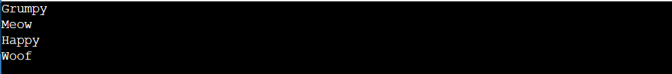
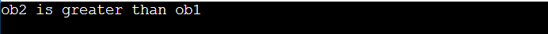
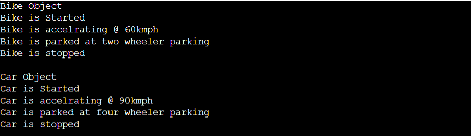
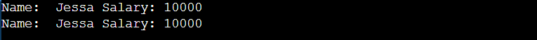
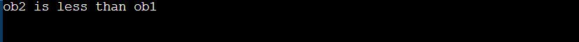

# EX NO 6(a)
## 🎯 Aim
To create two classes Cat and Dog with functions mood() and sound() which are same for both the classes yet they produce distinct outputs and iterate over the objects of the two classes “Cat” and “Dog” without worrying about the class types

## 🧠 Algorithm
1. Define Two classes named `Cat` and `Dog`
2. Define two methods namely `mood()` and `sound()` in both the classes.
3. Call both the methods using respective objects of each classes.

## 💻 Program
```
class Cat:
    def mood(self):
        print("Grumpy")
    def sound(self):
        print("Meow")
 
class Dog:
    def mood(self):
        print("Happy")
    def sound(self):
        print("Woof")
 
hello_kitty = Cat()
hello_puppy = Dog()
 
for pet in (hello_kitty, hello_puppy):
    pet.mood()
    pet.sound()
```

## Output


## Result
Thus a python program to create two classes with functions mood() and sound() has been written and executed successfully.


# EX NO 6(b)
## 🎯 Aim
To write a python program to overload a comparison operator 

## 🧠 Algorithm
1. Define a class named A
2. Overload `>` using `__gt__` method
3. Print the result 

## 💻 Program
```
class A:
    def __init__(self,a):
        self.a=a
    def __gt__(self,other):
        return self.a>other.a
ob1=A(2)
ob2=A(3)
if ob2>ob1:
    print("ob2 is greater than ob1")
else:
    print("ob1 is greater than ob2")
```

## Output


## Result
Thus a python program to write a python program to overload a comparison operator has been written and executed successfully.

# EX NO 6(c)
## 🎯 Aim
To create a class VEHICLE  which is Abstract Class and CAR and BIKE are Child Classes. VEHICLE class have two unimplemented methods, which are implemented in child Classes..

## 🧠 Algorithm
1. Create an Abstract class named Vehicle.
2. Create two child classes Bike and Car.
3. Implement the methods defined in Abstract class in the child classes

## 💻 Program
```
#Abstract Class
class Vehicle:
    def start(self,name=""):
        print(name,"is Started")
    def acclerate(self,name=""):
        pass
    def park(self,name=""):
        pass
    def stop(self,name=""):
        print(name,"is stopped")

class Bike(Vehicle):
    def acclerate(self, name=""):
        self.name=name
        print(self.name,"is accelrating @ 60kmph")
    #Define park method
    def park(self,name):
        self.name=name
        print(self.name,"is parked at two wheeler parking")
    def stop(self,name):
        self.name=name
        print(self.name,"is stopped")
        

class Car(Vehicle):
#Define accelarate method

    def accelerate(self,name):
        self.name=name
        print(self.name,"is accelrating @ 90kmph")
    def park(self, name=""):
        self.name=name
        print(self.name,"is parked at four wheeler parking")
    def stop(self,name):
        print(self.name,"is stopped")

def main():
    print("Bike Object")
    b=Bike()
    #Call the methods of bike class
    b.start("Bike")
    b.acclerate("Bike")
    b.park("Bike")
    b.stop("Bike")

    print("\nCar Object")
    c = Car()
    c.start("Car")
    c.accelerate("Car")
    c.park("Car")
    c.stop("Car")
if __name__=="__main__":
    main()
```

## Output


## Result
Thus a python program to create a class VEHICLE which is Abstract Class and CAR and BIKE are Child Classes has been written and executed successfully.

# EX NO 6(d)
## 🎯 Aim
To create a class Employee with public method show to display the details of the employee.

## 🧠 Algorithm
1. Create a class named Employee
2. Define constructor and initialize the values.
3. Define a function named display() to display the employee values


## 💻 Program
```
class Employee:
    # constructor
    def __init__(self, name, salary):
        # public data members
        self.name = name
        self.salary = salary
    def display(self):
        print("Name: ",emp.name,"Salary:",emp.salary)

    # public instance methods
    
# creating object of a class
emp = Employee('Jessa', 10000)

# accessing public data members
print("Name: ", emp.name, 'Salary:', emp.salary)
emp.display()
# call public method of the class

```

## Output


## Result
Thus a python program to create a class Employee with public method show to display the details of the employee has been written and executed successfully.


# EX NO 6(e)
## 🎯 Aim
To write a python program to overload less than operator 

## 🧠 Algorithm
1. Define a Class named A
2. Overload the less than operator using `__lt__` method.
3. Print the result.

## 💻 Program
```
class A:
    def __init__(self,a):
        self.a=a
    def __lt__(self,other):
        return self.a<other.a
ob1=A(200)
ob2=A(30)
if ob2<ob1:
    print("ob2 is less than ob1")
else:
    print("ob1 is less than ob2")
```

## Output


## Result
Thus a python program to write a python program to overload less than operator has been written and executed successfully.


